# Automatización de luces con sensores de presencia

**Nombre:** Jesus Eduardo Galeana Leja
**No. Control:** 22211565
**Fecha:** 19 de octubre de 2025

## Propósito del sistema
El propósito de este sistema es el de optimizar el consumo eléctrico, así como también permitir tener comodidad al usuario y facilitar la gestión inteligente de entornos domésticos.

## Diagrama de arquitectura

```mermaid
flowchart LR
 subgraph Sensores["Sensores"]
        Sensor["Sensor PIR"]
  end
 subgraph Broker["Microcontrolador"]
        Microcontrolador["Raspberry PI"]
  end
 subgraph Broker["Mosquitto (EC2)"]
        MQTT["Broker MQTT"]
  end
 subgraph Pipeline["Procesamiento de Datos"]
        Tele["Telegraf (Suscriptor MQTT)"]
        DB["InfluxDB (Base de datos temporal)"]
  end
 subgraph s1["Grafana"]
        Graf["Dashboards con métricas"]
  end
    Sensor -- Detecta el movimiento --> Microcontrolador
    Microcontrolador -- Recoge los datos del sensor y los transmite por MQTT --> MQTT
    MQTT -- Recibe los datos y los transmite --> Tele
    Tele -- Se suscribe y envía datos a InfluxDB --> DB
    DB -- Guarda métricas y las visualiza por Grafana --> Graf
```

