# Automatización de luces con sensores de presencia

**Nombre:** Jesus Eduardo Galeana Leja

**No. Control:** 22211565

## Propósito del sistema
El propósito de un sistema de automatización de luces con sensores de presencia es el de optimizar el uso de la energía eléctrica por medio del uso del encendido y el apagado inteligente de la iluminación, tomando en consideración el movimiento o la presencia dentro de un espacio determinado. Se busca que con esto, se pueda tener eficiencia energética, así como también otorgar comodidad del usuario y sostenibilidad ambiental utilizando el IoT para crear dichos entornos. 

Con esto en cuenta, este sistema le permite al usuario:
* Detectar el movimiento y registrar los eventos de presencia.
* Transmitir datos en tiempo real por medio de un protocolo de comunicación ligero (MQTT).
* Almacenar y procesar los datos dentro de una base de datos temporal.
* Ver el comportamiento de los sensores por medio de gráficos en tiempo real utilizando Grafana.

## Herramientas requeridas 

**1. Sensor simulado en Python / Sensor real**

En el caso de utilizar un sensor simulado, se puede utilizar un programa en Python para simular el funcionamiento por medio de variables aleatorias de detección. En caso de querer realizar esto de forma previa dentro de un entorno simulado, esto puede ser de gran utilidad. Un ejemplo de esto sería:
```python
presencia = random.choice(0,1)
```
En este caso, el 0 representa la ausencia del movimiento, mientras que el uno representa el movimiento detectado. Estos valores son los que se enviarían por medio de MQTT.

En caso de utilizar un sensor real, se requeriría de un sensor PIR (pasivo infrraroja) para poder medir la radiación que se emite por los cuerpos en movimiento, conectándose físicamente por medio de un microcontrolador como sería Raspberry PI o ESP32.
El sensor se conecta por medio de un puerto de entrada y salida dentro del dispositivo, y al detectar el movimiento se envía una señal eléctrica hacia el microcontrolador, la cual lee y termina enviando al broker de MQTT.

**2. MQTT (Mosquitto)**


El broker MQTT es el encargado de recibir la información y comunicarla hacia la base de datos, sirviendo como un intermediario dentro del sistema. 
El sensor se encarga de entregar los datos dentro de un tópico MQTT (ejemplo: casa/luces). Y Telegraf se suscribe dentro del tópico para poder recibir los mensajes.
Un ejemplo de mensaje sería el siguiente: 
```json
{
  "sensor": "PIR",
  "presencia": 1,
  "timestamp": 1730000123
}
```

**3. Telegraf**


Telegraf tiene la función de actuar como un puente entre el broker MQTT y la base de datos temporal dentro de InfluxDB. Es el encargado de escuchar los mensajes dentro del tópico MQTT y enviarlos como puntos de datos dentro de InfluxDB.
```toml
[[inputs.mqtt_consumer]]
  topics = ["casa/luces/presencia"]

[[outputs.influxdb]]
  urls = ["http://localhost:8086"]
  database = "iot_db"
```

**4. InfluxDB**


InfluxDB servirá como una base de datos temporal para almacenar los datos que se entregarán hacia Grafana. En caso de que se haga algún tipo de movimiento, InfluxDB guardará una entrada de la siguiente forma:
| time                 | presencia | sensor |
| -------------------- | --------- | ------ |
| 2025-10-22T18:23:00Z | 1         | PIR    |
| 2025-10-22T18:23:05Z | 0         | PIR    |

**5. Grafana** 


Grafana es el encargado de mostrar los datos por medio de paneles visuales. Esto se realiza por medio de la conexión hacia InfluxDB, permitiendo consultar los datos que se encuentran presentes. Con Grafana pueden apreciarse los siguientes datos
* Gráficas de cuando se presenció movimiento.
* Indicadores en tiempo real.
* Alertas si se deja de detectar movimiento luego de cierto tiempo.

Este es un ejemplo de consulta de datos dentro de Grafana.
```sql
SELECT "presencia" FROM "sensor_presencia"
```
**Opcional: Tailscale**

Tailscale es un VPN que permite crear un red segura y cifrada entre distintos dispositivos, sin requerir de la apertura de puertos ni configurar firewalls. En caso de querer evitar realizar estos procesos, Tailscale permite el acceso a los puertos 1883 (Mosquitto), 8086 (InfluxDB) y 3000 (Grafana) entre todos aquellos dispositivos que se encuentren dentro de la red privada de Tailscale.


## Diagrama de arquitectura

```mermaid
flowchart LR
 subgraph Sensores["Sensores"]
        Sensor["Sensor PIR"]
  end
 subgraph Broker["Microcontrolador"]
        Microcontrolador["Raspberry PI"]
  end
 subgraph Broker["Mosquitto (EC2)"]
        MQTT["Broker MQTT"]
  end
 subgraph Pipeline["Procesamiento de Datos"]
        Tele["Telegraf (Suscriptor MQTT)"]
        DB["InfluxDB (Base de datos temporal)"]
  end
 subgraph s1["Grafana"]
        Graf["Dashboards con métricas"]
  end
    Sensor -- Detecta el movimiento --> Microcontrolador
    Microcontrolador -- Recoge los datos del sensor y los transmite por MQTT --> MQTT
    MQTT -- Recibe los datos y los transmite --> Tele
    Tele -- Se suscribe y envía datos a InfluxDB --> DB
    DB -- Guarda métricas y las visualiza por Grafana --> Graf
```



